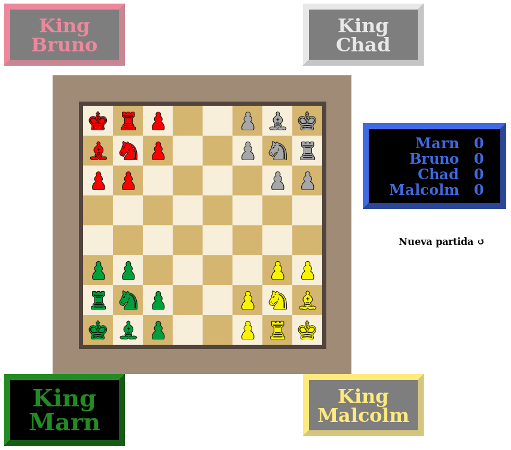

As of 7 May 2020, this game has been hosted by, and is playable at, [Ajedrez Eureka](https://www.ajedrezeureka.com/ajedrez-de-4-jugadores/).

Just clone into its own directory and open index.html in a JS enabled browser.

To play, click (or tap) a piece, then click one of the highlighted squares.

There's no persistance, network code, or checkmate detection (though you can't move your king into check).

Any contributions welcome.

I've used mootools and some non-free (watermarked) assets.
